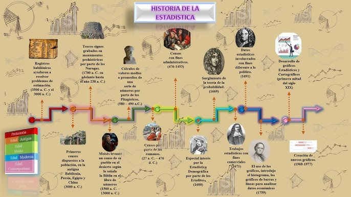

```{=html}
<div style="position: absolute; top: 10px; right: 10px;">
  
</div>
```

```{=html}
<style type="text/css">
  body {
    font-size: 130%;
    text-align: justify;
  }
</style>
```

# .Cargar paquetes

```{r}
ipak <- function(pkg){
  
  # Definir repositorio CRAN (evita el error del mirror)
  options(repos = c(CRAN = "https://cloud.r-project.org"))
  
  # Identificar paquetes instalados
  installed <- rownames(installed.packages())
  
  # Identificar paquetes faltantes
  new.pkg <- setdiff(pkg, installed)
  
  # Instalar paquetes faltantes
  if(length(new.pkg) > 0){
    install.packages(new.pkg, dependencies = TRUE)
  }
  
  # Cargar paquetes sin mostrar mensajes
  invisible(lapply(pkg, function(p){
    suppressPackageStartupMessages(
      library(p, character.only = TRUE)
    )
  }))
}

# Crear la lista de los paquetes a utilizar
packages <- c("tidyverse", "kableExtra", "psych", "readxl")

# Instalar y cargar los paquetes del listado anterior
ipak(packages)
```

# Historia De Le Estadistíca

La **Historia de la Estadística** es el desarrollo de los métodos para recolectar, organizar, analizar e interpretar datos con el fin de tomar decisiones y comprender fenómenos sociales, económicos y científicos.

**Origen de la Estadística**

La palabra “estadística” proviene del término alemán *Statistik*, relacionado con el estudio del Estado. Desde la antigüedad, los gobiernos necesitaban contar personas, animales, tierras y riquezas para cobrar impuestos, organizar ejércitos y administrar recursos.

**Antigüedad**

- En Egipto se realizaban censos para construir pirámides y recaudar impuestos.
- En China y Roma también se hacían registros de población y propiedades.
- Los romanos utilizaron censos periódicos para fines militares y administrativos.

**Desarrollo en la Edad Media**

Durante la Edad Media, la recopilación de datos continuó principalmente para fines tributarios y religiosos. Los reinos europeos llevaban registros de nacimientos, matrimonios y defunciones.

**Estadística Moderna**

**Siglo XVII**

En este período comenzaron los primeros estudios científicos sobre datos:

- John Graunt analizó registros de mortalidad en Londres y es considerado uno de los padres de la estadística.
- Blaise Pascal y Pierre de Fermat desarrollaron la teoría de la probabilidad.

**Siglo XVIII**

La estadística empezó a utilizarse para estudiar fenómenos económicos y sociales. Los gobiernos europeos mejoraron los censos y registros poblacionales.

**Siglo XIX**

La estadística avanzó gracias a las matemáticas:

- Carl Friedrich Gauss desarrolló métodos relacionados con la distribución normal.
- Adolphe Quetelet aplicó la estadística al estudio de la sociedad.

**Estadística en el Siglo XX**

La estadística se convirtió en una herramienta fundamental en:

- Medicina
- Economía
- Psicología
- Ingeniería
- Ciencias sociales

Destacan científicos como:

- Ronald Fisher, quien desarrolló técnicas modernas de inferencia estadística y diseño experimental.
- Karl Pearson, creador de importantes métodos de correlación y análisis.

**Estadística Actual**

Hoy la estadística es esencial en:

- Inteligencia artificial
- Big Data
- Investigación científica
- Empresas y mercados
- Predicciones económicas y climáticas

Gracias a las computadoras y al análisis de grandes cantidades de datos, la estadística tiene aplicaciones en casi todas las áreas del conocimiento.

**Importancia de la Estadística**

La estadística permite:

- Tomar decisiones informadas
- Analizar información
- Realizar predicciones
- Comprender fenómenos sociales y naturales
- Mejorar procesos científicos y empresariales

{fig-align="center"}

# Variables

**Concepto de Variable Estadística**

En estadística, una **variable** es una característica, propiedad o atributo que puede tomar diferentes valores dentro de una población o muestra.

Las variables permiten recolectar, organizar y analizar información para apoyar la toma de decisiones.

En la **administración pública**, las variables se utilizan para:

- medir indicadores sociales,
- evaluar políticas públicas,
- analizar presupuestos,
- estudiar necesidades ciudadanas,
- controlar gestión institucional.

**Ejemplos en administración pública**

- Nivel de satisfacción ciudadana.
- Número de beneficiarios de un programa social.
- Tiempo de atención en una alcaldía.
- Presupuesto ejecutado.
- Nivel educativo de la población.

**Clasificación de las Variables Según su Naturaleza**

Las variables se clasifican en:

**A. Variables Cualitativas**

Describen cualidades, categorías o atributos. No se expresan numéricamente como cantidades matemáticas.

**Tipos de variables cualitativas**

**a) Nominales**

Las categorías no tienen orden.

Ejemplos en administración pública

- Tipo de servicio público recibido:

  - salud
  - educación
  - seguridad
  - transporte

- Estado civil de funcionarios públicos.

- Departamento o municipio de residencia.

**b) Ordinales**

Las categorías tienen un orden o jerarquía.

**Ejemplos**

- Nivel de satisfacción ciudadana:

  - muy satisfecho
  - satisfecho
  - regular
  - insatisfecho

- Clasificación de desempeño laboral:

  - excelente
  - bueno
  - regular
  - deficiente

**B. Variables Cuantitativas**

Representan cantidades numéricas y permiten operaciones matemáticas.

**Tipos de variables cuantitativas**

**a) Discretas**

Toman valores enteros y generalmente provienen de conteos.

**Ejemplos**

- Número de empleados públicos.
- Cantidad de subsidios otorgados.
- Número de denuncias ciudadanas.
- Cantidad de hospitales públicos.

**b) Continuas**

Pueden tomar cualquier valor dentro de un intervalo.

**Ejemplos**

- Tiempo de espera en atención ciudadana.
- Porcentaje de ejecución presupuestal.
- Ingreso promedio de hogares.
- Distancia recorrida por vehículos oficiales.

**Escalas de Medición de las Variables**

Las escalas de medición indican cómo se pueden interpretar y analizar los datos.

**A. Escala Nominal**

**Características**

- Clasifica en categorías.
- No existe orden entre categorías.

**Ejemplos en administración pública**

| Variable         | Categorías                                   |
|------------------|----------------------------------------------|
| Tipo de contrato | Planta, provisional, prestación de servicios |
| Género           | Masculino, femenino, otro                    |
| Tipo de entidad  | Nacional, departamental, municipal           |

**Operaciones permitidas**

- Conteo
- Frecuencias
- Porcentajes

------------------------------------------------------------------------

**B. Escala Ordinal**

**Características**

- Existe orden entre categorías.
- No se puede medir exactamente la distancia entre categorías.

**Ejemplos**

| Variable               | Categorías        |
|------------------------|-------------------|
| Nivel de satisfacción  | Bajo, medio, alto |
| Prioridad de proyectos | Alta, media, baja |
| Nivel socioeconómico   | 1, 2, 3, 4, 5, 6  |

**Operaciones permitidas**

- Ordenamiento
- Comparaciones
- Medianas
- Percentiles

**C. Escala de Intervalo**

**Características**

- Los valores tienen intervalos iguales.
- No existe cero absoluto.

**Ejemplos**

| Variable                      | Ejemplo          |
|-------------------------------|------------------|
| Temperatura ambiental         | 20°C, 25°C       |
| Año de ejecución presupuestal | 2020, 2021, 2022 |

**Operaciones permitidas**

- Suma
- Resta
- Promedios

**Limitación**

No tiene sentido afirmar:

> “40°C es el doble de 20°C”.

**D. Escala de Razón**

**Características**

- Tiene cero absoluto.
- Permite todas las operaciones matemáticas.

**Ejemplos en administración pública**

| Variable                       | Ejemplo           |
|--------------------------------|-------------------|
| Salario de funcionarios        | \$2.000.000       |
| Número de ciudadanos atendidos | 500 personas      |
| Presupuesto municipal          | \$10.000 millones |
| Tiempo de atención             | 15 minutos        |

**Operaciones permitidas**

- Suma
- Resta
- Multiplicación
- División
- Razones y proporciones

**Resumen General**

| Clasificación | Tipo     | Característica    | Ejemplo Administración Pública |
|----------------|----------------|----------------|-------------------------|
| Cualitativa   | Nominal  | Sin orden         | Tipo de servicio público       |
| Cualitativa   | Ordinal  | Con orden         | Nivel de satisfacción          |
| Cuantitativa  | Discreta | Conteos enteros   | Número de funcionarios         |
| Cuantitativa  | Continua | Valores infinitos | Tiempo de atención             |

**Importancia de las Variables en la Administración Pública**

**Las variables permiten**:

- Diseñar políticas públicas basadas en evidencia.
- Medir eficiencia institucional.
- Evaluar impacto social.
- Elaborar indicadores de gestión.
- Mejorar la transparencia y el control gubernamental.
- Realizar análisis estadísticos para la toma de decisiones.

**Ejemplo Integrador**

**Estudio: Calidad del Servicio en una Alcaldía**

| Variable                      | Tipo                  | Escala  |
|-------------------------------|-----------------------|---------|
| Edad del ciudadano            | Cuantitativa continua | Razón   |
| Número de trámites realizados | Cuantitativa discreta | Razón   |
| Nivel de satisfacción         | Cualitativa ordinal   | Ordinal |
| Tipo de trámite               | Cualitativa nominal   | Nominal |
| Tiempo de atención            | Cuantitativa continua | Razón   |

# Clasificación De Variables

diccionario_variables \<- data.frame( Variable = c( "Calidad del servicio público", "Cantidad de energía consumida", "Cantidad de recursos naturales consumidos", "Categoría de proyecto", "Clasificación de entidad pública", "Complejidad de los trámites", "Crecimiento económico anual", "Departamento de trabajo", "Gastos operativos mensuales", "Grado de cumplimiento de las regulaciones", "Grado de innovación en políticas", "Grado de satisfacción de los ciudadanos", "Índice de pobreza", "Índice de satisfacción ciudadana", "Modalidad de adjudicación", "Nivel de acceso a servicios públicos", "Nivel de deuda pública", "Nivel de experiencia del personal", "Nivel de riesgo de proyectos", "Nivel de urgencia de las solicitudes", "Actas levantadas", "Número de auditorías internas", "Número de comisiones creadas", "Número de contratos adjudicados", "Número de días de trabajo perdidos por huelga", "Número de empleados en una oficina", "Número de expedientes archivados", "Número de inspecciones realizadas", "Número de licencias emitidas", "Número de propuestas recibidas", "Número de proyectos completados", "Número de quejas recibidas", "Número de reuniones realizadas", "Número de sanciones impuestas", "Número de solicitudes de información", "Porcentaje de cumplimiento de metas", "Porcentaje de inversión en infraestructura", "Presupuesto anual asignado", "Prioridad de los proyectos", "Régimen de seguridad social", "Salario promedio de los empleados", "Sector gubernamental", "Tasa de criminalidad por 1000 habitantes", "Tasa de desempleo en la región", "Tasa de rotación de personal", "Tiempo promedio de respuesta a solicitudes", "Tipo de ciudadano atendido", "Tipo de contrato", "Tipo de documentación", "Tipo de servicio público" ), Tipo = c( "Ordinal", "Continua", "Continua", "Nominal", "Nominal", "Ordinal", "Continua", "Nominal", "Continua", "Ordinal", "Ordinal", "Ordinal", "Continua", "Continua", "Nominal", "Ordinal", "Continua", "Ordinal", "Ordinal", "Ordinal", "Discreta", "Discreta", "Discreta", "Discreta", "Discreta", "Discreta", "Discreta", "Discreta", "Discreta", "Discreta", "Discreta", "Discreta", "Discreta", "Discreta", "Discreta", "Continua", "Continua", "Continua", "Ordinal", "Nominal", "Continua", "Nominal", "Continua", "Continua", "Continua", "Continua", "Nominal", "Nominal", "Nominal", "Nominal" ) )

View(diccionario_variables)
